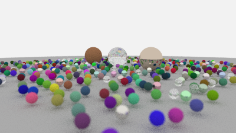

# Raytracing In One Week
Implemented path tracer

One week result image(actually it takes me almost one month 0...0):  

(640/400----including material: dielectric,lambertian,metal)

# Raytracing In Next Week  
Next week session2 result:  
  
(400/225 200spp --- random scene with bounding volume hierarchy)

Cornell box：  
   
(640/640 400spp)  
